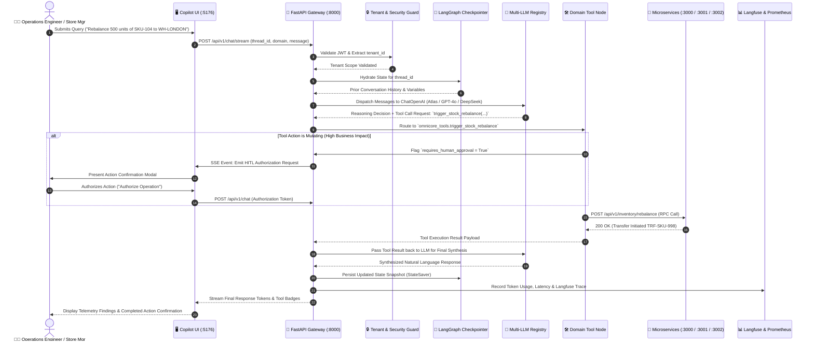

# 🤖 Retail Intelligence Agent

> **Production-Ready FastAPI + LangGraph AI Copilot Microservice for Enterprise Retail Operations.**

---

## 🎯 Architecture

This service implements stateful multi-agent workflows using **LangGraph** exposed over a high-performance **FastAPI** REST and Server-Sent Events (SSE) streaming API.

---

## 🔄 End-to-End Business Process Workflow

The following sequence diagram details the operational lifecycle of an autonomous AI Agent interaction—from multi-tenant user query ingestion to LangGraph state hydration, tool execution across microservices, Human-in-the-Loop (HITL) authorization, and live streaming output:



### 📋 Step-by-Step Business Process Stages:

1. **User Query & Context Ingestion**: Operations staff submits a natural language question or action command through the Copilot web interface or automated cron triggers.
2. **Tenant Scoping & Security Enforcement**: FastAPI validates the operator's JWT session, extracting the verified `tenant_id` to strictly isolate execution.
3. **State Hydration from Checkpointer**: The LangGraph engine loads the conversation thread's prior turns and state from persistent storage (`MemorySaver` or `PostgresSaver`).
4. **Wire-Compatible LLM Reasoning**: The `LLMRegistry` dispatches the state to the configured provider (Atlas Cloud, DeepSeek, OpenAI, Claude, Gemini) with bounded tool definitions.
5. **Deterministic Tool Invocation**: If the model determines that real-time telemetry or actions are needed, it yields structured tool calls dispatched to OmniCore (:3000), ClearSettle (:3001), or EdgePulse (:3002).
6. **Human-in-the-Loop (HITL) Authorization**: If the tool is designated as mutating (e.g. stock transfers or payment gateway route overrides), graph execution pauses until human authorization is confirmed.
7. **State Checkpointing & Observability Export**: The updated state is checkpointed, Prometheus golden signal counters are updated, and full run traces are sent to Langfuse for auditing.

---

```
retail-intelligence-agent/
├── backend/
│   ├── app/
│   │   ├── api/v1/          # Endpoints: /chat, /chat/stream, /health, /metrics
│   │   ├── core/            # Config, LLM Registry, Memory Checkpointers
│   │   ├── graphs/          # LangGraph state schema and compiled workflow
│   │   ├── tools/           # Domain tools (OmniCore, ClearSettle, EdgePulse)
│   │   └── main.py          # FastAPI application entrypoint
│   ├── tests/               # Pytest test suite
│   ├── requirements.txt     # Python dependencies
│   └── .env.example         # Environment template
│
├── frontend/                # React / Vite / TypeScript Copilot Workspace
└── docs/                    # Architecture Specs, PRD, Blueprint, OpenAPI 3.1
```

---

## ⚙️ Configuration Guide

### 1. Configure the LLM (`backend/.env`)

Copy `.env.example` to `.env` and set your preferred model credentials:

```bash
cp backend/.env.example backend/.env
```

```env
# Atlas Cloud / DeepSeek:
OPENAI_API_KEY=your_key_here
OPENAI_BASE_URL=https://api.atlascloud.ai/v1
DEFAULT_LLM_MODEL=deepseek-ai/deepseek-v4-pro

# OpenAI:
OPENAI_API_KEY=sk-...
OPENAI_BASE_URL=https://api.openai.com/v1
DEFAULT_LLM_MODEL=gpt-4o-mini
```

### 2. Configure LangGraph State Checkpointing

In [`backend/app/core/checkpointer.py`](file:///Users/jat/Documents/Portfolio_Project/Project/ai-apps/retail-intelligence-agent/backend/app/core/checkpointer.py):

* **Development**: Uses `MemorySaver()` for in-memory session states.
* **Production**: Replace with `PostgresSaver(conn)` or `RedisSaver()` to persist conversation checkpoints across container instances.

### 3. Add Custom Domain Tools

Tools are declared as standard Python functions decorated with `@tool` in [`backend/app/tools/`](file:///Users/jat/Documents/Portfolio_Project/Project/ai-apps/retail-intelligence-agent/backend/app/tools/):

```python
from langchain_core.tools import tool

@tool
def get_custom_metric(param: str) -> dict:
    """Document tool purpose and input parameters clearly for the LLM."""
    return {"status": "SUCCESS", "data": param}
```

Then register the tool in `ALL_TOOLS` inside [`backend/app/graphs/retail_copilot_graph.py`](file:///Users/jat/Documents/Portfolio_Project/Project/ai-apps/retail-intelligence-agent/backend/app/graphs/retail_copilot_graph.py).

---

## 🚀 Running the Service

### Run Backend
```bash
cd backend
python3 -m venv .venv
source .venv/bin/activate
pip install -r requirements.txt
uvicorn app.main:app --reload --port 8000
```
Swagger UI available at: `http://localhost:8000/docs`

### Run Frontend
```bash
cd frontend
npm install
npm run dev
```
UI available at: `http://localhost:5176`
