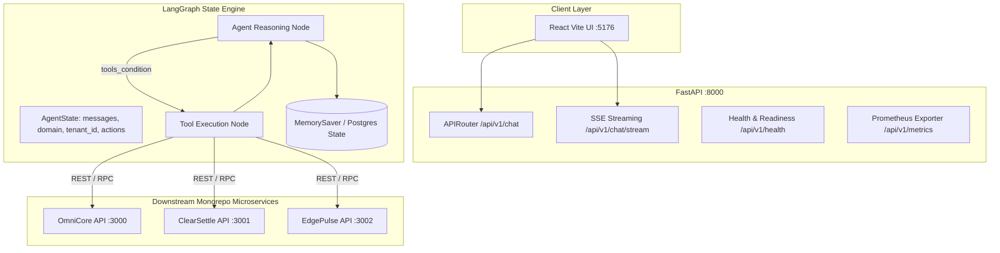

# 🏛️ Architecture & LangGraph Design: Retail Intelligence Agent

## 1. System Architecture

## 2. LLM Wire Compatibility
The `LLMRegistry` uses `langchain_openai.ChatOpenAI` configuring `OPENAI_BASE_URL` and `OPENAI_API_KEY`. It allows instant, zero-code-change switching across Atlas Cloud, OpenAI GPT-4o, Anthropic Claude (via proxy), Google Gemini, DeepSeek, and local Ollama instances.

## 3. Configuration & State Lifecycle Matrix

| Layer | Configuration Point | Implementation Detail |
| :--- | :--- | :--- |
| **API Server** | [`app/core/config.py`](../backend/app/core/config.py) | Pydantic BaseSettings loading `.env` variables with strict typing. |
| **Model Registry** | [`app/core/llm_registry.py`](../backend/app/core/llm_registry.py) | Dynamic factory for OpenAI-compatible model instances with fallback handling. |
| **State Persistence** | [`app/core/checkpointer.py`](../backend/app/core/checkpointer.py) | Session state persistence with support for in-memory and PostgreSQL checkpointers. |
| **Graph Topology** | [`app/graphs/retail_copilot_graph.py`](../backend/app/graphs/retail_copilot_graph.py) | StateGraph nodes, tool bindings, and system prompt logic. |
| **Tools Registry** | [`app/tools/`](../backend/app/tools/) | Isolated tool modules for OmniCore, ClearSettle, and EdgePulse RPCs. |

